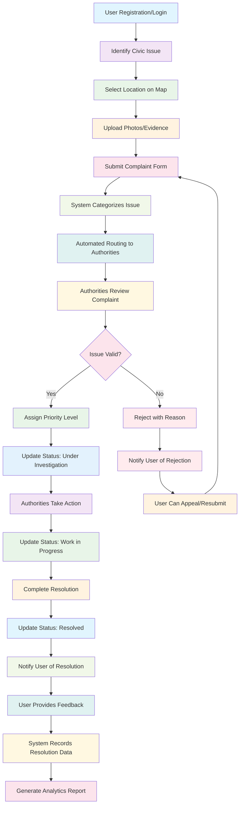

# Sadak Sathi Project Workflow Diagram

## Workflow Description

### Phase 1: User Engagement
1. **User Registration/Login** - Users create accounts or log in to access the platform
2. **Identify Civic Issue** - Users identify problems like potholes, broken streetlights, etc.
3. **Select Location on Map** - Users pinpoint exact location using interactive maps
4. **Upload Photos/Evidence** - Users provide visual evidence of the issue
5. **Submit Complaint Form** - Users complete and submit the complaint

### Phase 2: System Processing
6. **System Categorizes Issue** - AI/automated system categorizes the complaint type
7. **Automated Routing to Authorities** - System routes complaint to appropriate department
8. **Authorities Review Complaint** - Municipal staff review the submitted complaint

### Phase 3: Issue Resolution
9. **Issue Validation** - Authorities validate if the issue is legitimate
10. **Priority Assignment** - Valid issues are assigned priority levels
11. **Status Updates** - System tracks progress through various stages
12. **Action Implementation** - Authorities take physical action to resolve the issue
13. **Resolution Completion** - Issue is resolved and marked as complete

### Phase 4: Feedback & Analytics
14. **User Notification** - Users are notified of resolution
15. **User Feedback** - Users provide feedback on resolution quality
16. **Data Recording** - System records all resolution data
17. **Analytics Generation** - System generates reports for authorities

### Alternative Path: Issue Rejection
- If issue is invalid, authorities can reject with reasons
- Users are notified and can appeal or resubmit
- Rejected complaints can be resubmitted with additional information

## Key Features of the Workflow

- **Transparency**: All steps are visible to users
- **Accountability**: Each action is tracked and recorded
- **Efficiency**: Automated routing reduces delays
- **Feedback Loop**: Continuous improvement through user feedback
- **Data Analytics**: Insights for better resource allocation 